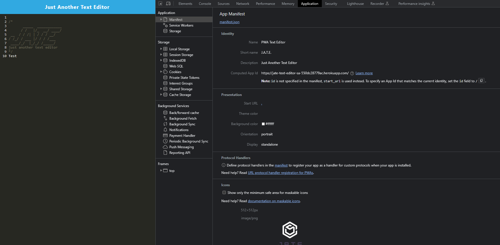
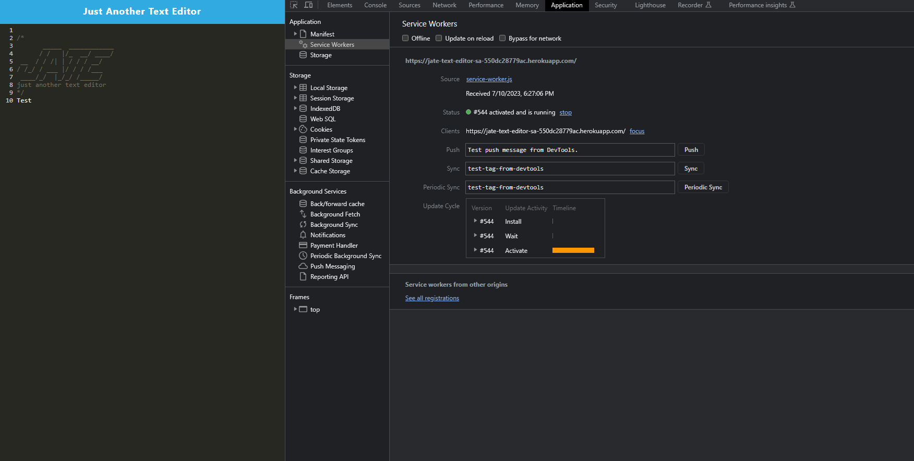
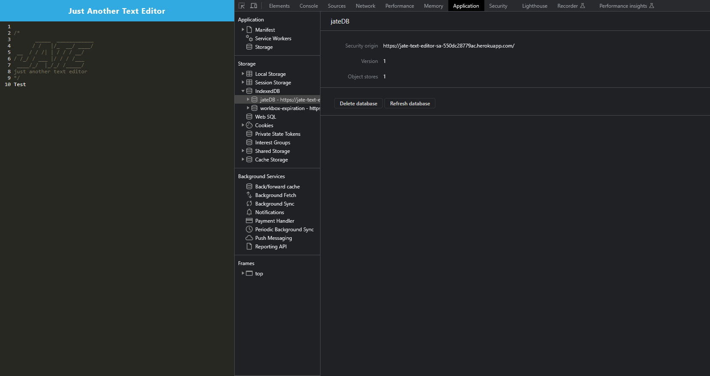

# JATE-text-editor
## Table of Contents
1. [Description](#description)
2. [Technology](#technology)
3. [Installation](#installation)
4. [Images](#images)
6. [Heroku Deployed Link](#heroku-deployed-link)

## Description
Your task is to build a text editor that runs in the browser. The app will be a single-page application that meets the PWA criteria. Additionally, it will feature a number of data persistence techniques that serve as redundancy in case one of the options is not supported by the browser. The application will also function offline.

## Technology
This application utilizes the following technologies:

  * HTML
  * CSS
  * JavaScript
  * Node.js
  * Express.js
  * MongoDB
  * Mongoose
  * IndexedDB
  * Service Workers
  * Webpack
  * Babel
  * Heroku

## Installation
Run 'npm i' within the console to install all necessary dependencies.

Once complete, run 'npm run start' to start the server.

## Images
Manifest Setup

Service Worker Setup

IndexedDB Setup

## Heroku Deployed Link
https://desolate-taiga-69412.herokuapp.com/
